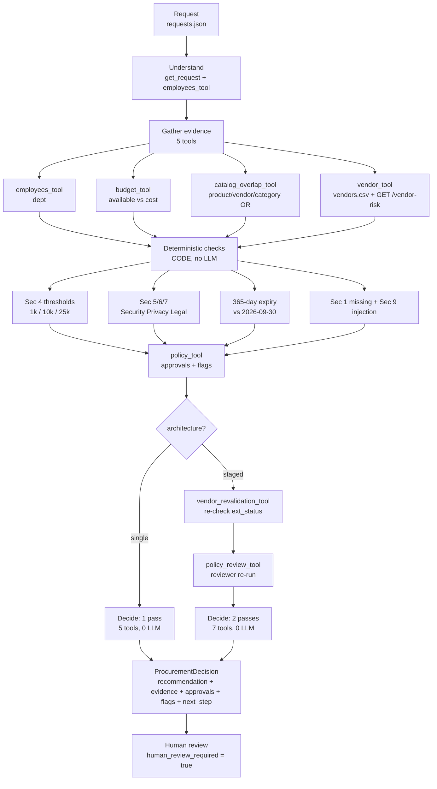

# Workflow / Architecture Notes

## 1. End-to-end workflow

```text
Request (requests.json: requester, product/vendor, cost, users, purpose, data_access, integrations)
  |
  v
Understand request [CODE: get_request() + employees_tool()]
  |
  v
Gather evidence [TOOLS - parallel where possible]
  |-- employees_tool -> department
  |-- budget_tool -> available_usd vs annual_cost
  |-- catalog_overlap_tool -> same product/vendor/category (OR logic)
  |-- vendor_tool -> vendors.csv + GET /vendor-risk/{vendor} (404/503 handled)
  |
  v
Deterministic checks [CODE - no LLM]
  |-- Sec 4 thresholds: <=1k Manager / <=10k DeptHead+Proc / <=25k +Finance / >25k +Finance+CFO
  |-- Sec 5/6/7: Security/Privacy/Legal triggers
  |-- 365-day expiry vs REFERENCE_DATE=2026-09-30
  |-- missing fields (Sec 1) + injection patterns (Sec 9)
  |
  v
Reason about policy & risk [single: inline rules / staged: reviewer pass]
  |
  v
Structured recommendation [ProcurementDecision: recommendation, evidence[], approvals[], missing[], flags[], next_step]
  |
  v
Human review / approval [always human_review_required=True, next_step routes to approvers]
```

Architecture A `single`: 1 pass, 5 tool calls, 0 LLM - gather -> check -> decide.
Architecture B `staged`: 2 passes, 7 tool calls, 0 LLM - Pass1 gather, Pass2 `vendor_revalidation_tool + policy_review_tool` re-check.

### Note: Currently both architectures are fully deterministic.

## 2. Tools Used

| Tool (telemetry name) | Type | Purpose | Inputs -> Outputs | Failure mode |
|---|---|---|---|---|
| `employees_tool` | Deterministic | dept lookup | `requester_id` -> `{department}` | `unknown ID -> emp_rows=[] -> dept=None -> missing dept item` |
| `budget_tool` | Deterministic | budget check | `dept, annual_cost` -> `{can_afford, available}` | `cost=None -> {missing_cost:True}` |
| `catalog_overlap_tool` | Deterministic | overlap Sec 3 | `product,vendor,category` -> `{overlap, existing_products}` | `no match -> {overlap:False}; never errors` |
| `vendor_tool` | External + deterministic compare | vendor Sec 5/10 | `vendor_name` -> `{internal, external, unavailable}` | `404/503 -> unavailable=True, flag vendor_risk_unavailable, don't infer approved` |
| `policy_tool` | Deterministic | Sec 4/5/6/7 engine | `cost+data+integrations+vendor state` -> `{business_approvals, need_security/privacy/legal}` | `cost=None -> business_approvals=[]` |
| `vendor_revalidation_tool` (staged only) | Deterministic | 2nd-pass audit | re-check `ext_status != approved` | `same as vendor_tool; external=None stays unavailable` |
| `policy_review_tool` (staged only) | Deterministic | reviewer re-run of policy engine | recount `policy_threshold_tool` outputs | `no-op recount; cost=None -> approvals=[]` |

Evidence grounding: `EvidenceItem.source == telemetry.tool_names` entry. e.g. `budget_tool -> department_budgets.csv`, `vendor_tool -> vendors.csv + GET /vendor-risk/{vendor}`, `policy_tool -> procurement_policy.md Sec 4-7/9`.

## 3. Deterministic vs model-driven

* CODE: thresholds, budget math, OR-overlap, 365-day expiry, missing-field, injection regex, approval union.
* AI: None yet
* HUMAN: purchase/approve/budget change/legal accept - copilot only recommends + routes.

## 4. Agent responsibilities

* Single-agent: calls all 5 tools, runs policy engine, builds `ProcurementDecision`.
* Staged Agent-1 (gatherer): Calls all 5 tools + computes vendor expiry/conflict vs 2026-09-30.
* Staged Agent-2 (reviewer): First revalidates the vendor using `vendor_revalidation_tool` and then reviews the policy using `policy_review_tool`.

## 5. Handoff format

`ProcurementDecision`: `request_id, recommendation, evidence[{source,finding,reference}], required_approvals[Manager/DeptHead/Proc/Finance/CFO/Security/Privacy/Legal], missing_information[], risk_flags[], next_step, human_review_required=True, telemetry{llm_calls,tool_calls,tool_names}`

## 6. Stop / escalation conditions

* `missing cost/users/data/integrations` -> `missing_information` + ask requester, don't invent.
* `vendor_unavailable/conflict/expired` -> `vendor_risk_unavailable/conflicting_vendor_evidence/vendor_review_expired` + Security/manual review.
* `budget exceed` -> `budget_insufficient` + Finance exception.
* `injection detected` -> ignore instruction, keep real policy, flag `prompt_injection_detected`.
* Always: `human_review_required=True`.

## 7. What intentionally NOT built

* No real LLM summarizer
* No auto-approve
* Assumptions: `REFERENCE_DATE=2026-09-30` (not wall-clock), `available_usd` snapshot, OR-overlap, `unknown` data = unsafe, request text = untrusted.

## 8. Diagram


